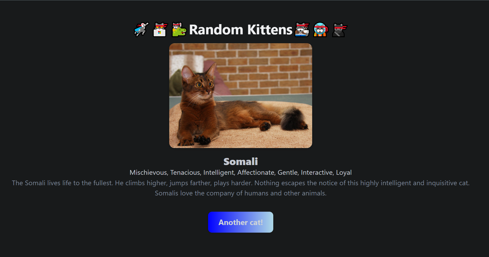

# Simple Cat App – PHP Playground

This repository contains personal PHP practice and a mini web app project.  
The **First steps** folder is dedicated to personal experimentation and learning the PHP language through basic exercises.  
Afterwards, a simple and basic web page was created as a small project, which displays random cats using [TheCatAPI](https://thecatapi.com/).

## Contents

- **First steps**  
  Files like `php_basics.php` and `php_more_practice.php` include exercises covering:
  - Echo and printing
  - Comments
  - Variables and data types
  - Arithmetic and booleans
  - Constants (define and const)
  - Arrays and associative arrays (Dictionaries)
  - Control Structures (loops, conditionals, etc)
  - Classes and objects
  - Regular expressions
  - Integration of PHP with HTML

- **Mini Web App:**  
  Located in `php-playground/simple_app/`, this app:
  - Fetches and displays random cats images with breed info from TheCatAPI
  - Uses PHP classes for API handling and data modeling
  - Demonstrates basic templating and styling

## How to Run

- **Clone the repository**
- **Install PHP** (if not already installed).

### 1. First steps (Practice Files)

You can run the practice files directly in your terminal:
```bash
cd php-playground/First_steps
php php_basics.php
php php_more_practice.php
```

### 2. Mini Web App

1. **Set your TheCatAPI key:**
   - Edit `php-playground/simple_app/config/ApiConstants.php` and add your API key.
   - **Note:** If you do not set the API key, the app will still display random cat images, but breed information and other details will not be shown.
2. **Start a local PHP server:**
   ```bash
   cd php-playground/simple_app
   php -S localhost:8000
   ```
3. Open [http://localhost:8000](http://localhost:8000) in your browser.



## Author
Nicole Araya B
